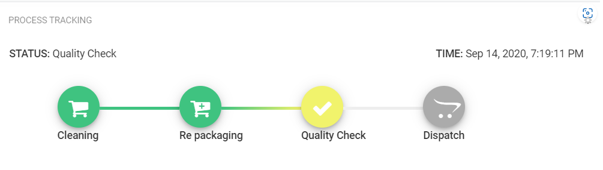
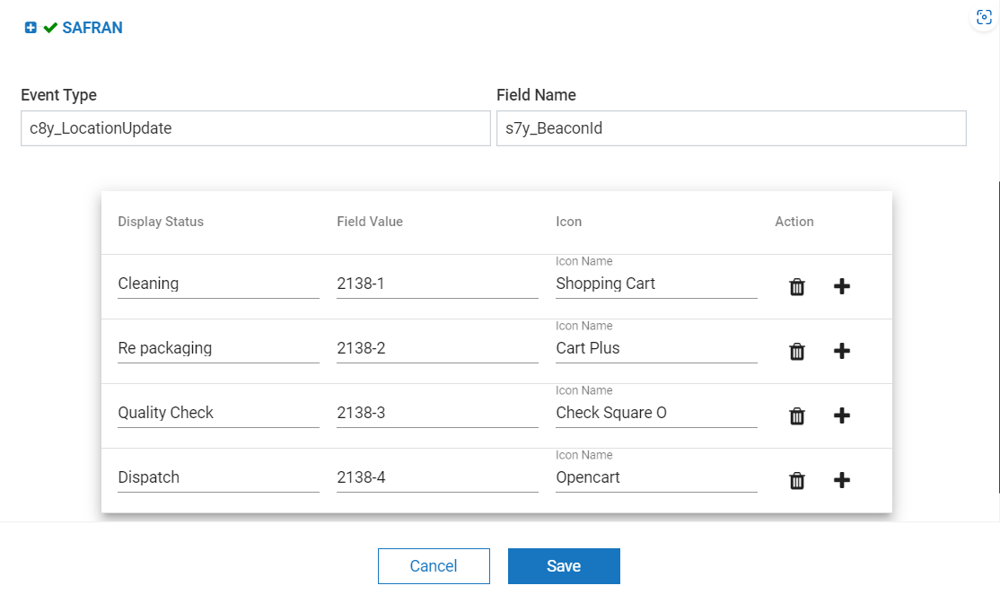

# Processing Widget Plugin for Cumulocity 

This is the Cumulocity module federation plugin created using c8ycli. This plugin can be used in Application Builder or Cockpit. The Processing Widget is designed to display the current process state based on the latest event. Updates the state whenever a new event is received.

To deliver the expected functionality one need to set/select the following configuration parameters:
 1. Event Type(required)
 2. Device/Group (select)
 3. Field Name(required)
 4. Display Status for each state (atleast 1)
 5. Field value for each state (atleast 1)
 6. mat-icon name for each state(select)
 7. Include child devices - You can toggle the slider if you want the results for child devices also.

  
### Please choose Processing Widget release based on Cumulocity/Application builder version:

| APPLICATION BUILDER &nbsp;|&nbsp; CUMULOCITY&nbsp;  | &nbsp;PROCESSING WIDGET &nbsp;|
|-------------------- |------------ |---------------------|
| 2.0.x               | >= 1016.x.x |	1.x.x              |

 ## Features

 *  **Support single device and group devices:** Based on widget configuration.
 *  **Display realtime process update:** whenever a new event is triggered it updates the state based on the field value.
 *  **Displays the current state of the process:** Displays the current state based on last event status.

## Prerequisite

   Cumulocity c8ycli >=1016.x.x

## Installation
 
### Runtime Widget Deployment?

* This widget support runtime deployment. Download [Runtime Binary](https://github.com/SoftwareAG/cumulocity-processing-widget-plugin/releases/download/1.0.1/sag-ps-pkg-processing-widget-1.0.1.zip) and use application builder to install your runtime widget.

## QuickStart
This guide will teach you how to add widget in your existing or new dashboard.

1. Open the Application Builder from the app switcher (Next to your username in the top right)

2. Click Add application

3. Enter the application details and click Save

4. Select Add dashboard

5. Click Blank Dashboard

6. Enter the dashboard details and click Save

7. Select the dashboard from the navigation

8. Check for your widget and test it out.

Congratulations! Processing Widget is configured.

  
## User Guide

1. Target Assets/Devices - deviceid/groupid of interest
2. Event Type - name of the event type
3. Field Name - The key name from event object whose value will decide the state.

Table Values - add as many rows as many process steps are there

5. Field Value - Add corresponding expected field values from field name.
6. Display Status - Add the Display status names that you want to display in the UI, for each and every field value. 
7. Icon - select the desired icons for each step from the dropdown 
8. Include child devices - You can toggle the slider if you want the results for child devices also

------------------------------
  
  
This widget is provided as-is and without warranty or support. They do not constitute part of the Software AG product suite. Users are free to use, fork and modify them, subject to the license agreement. While Software AG welcomes contributions, we cannot guarantee to include every contribution in the master project.
  
_____________________
  
For more information you can Ask a Question in the [TECHcommunity Forums](https://tech.forums.softwareag.com/tags/c/forum/1/Cumulocity-IoT).
  
  
You can find additional information in the [Software AG TECHcommunity](https://tech.forums.softwareag.com/tag/Cumulocity-IoT).

